## Link to website:
Website: (https://rbtttttt.github.io/Noah-bar/)
Repo: (https://github.com/rbtttttt/Noah-bar)

# Noah's Bar - Markdown

## Overview:
 This website is a showcase of cocktails for Noah's cocktail Bar and Restaurant the target audience are consumers who are looking to dine at the bar and to give a more detailed description and story of the product before the consumer arrives at the bar. In This website, the user can find information on the cocktails, recipes, bar name, bar location, creator of cocktail.

 A carousel system has been added into the main page with each signature cocktail displayed each slide. Each slide will have the name of the cocktail and a short description and the background of the page will be changed to an image of the cocktail.

 The website will be multiple pages in one, allowing the user to scroll from the top to the bottom creating an experience like reading a menu from a cocktail bar.

 ## User Stories:
Home Page:
- Click next & prev buttons to view cocktails in carousel.
- Click see more to see specific cocktail.
Cocktail Pages:
- Click next & prev buttons to visit next cocktail page.
About Page:
- Click video to watch short introduction video.
- Fill in form for contact details.
- Click google maps to visit google maps location of bar.
Nav Bar:
- Click home to visit home page
- Click specific cocktail to visit cocktail page
- Click About to visit info section.

## Wire Frames
 #### Wireframe for small and medium width devices
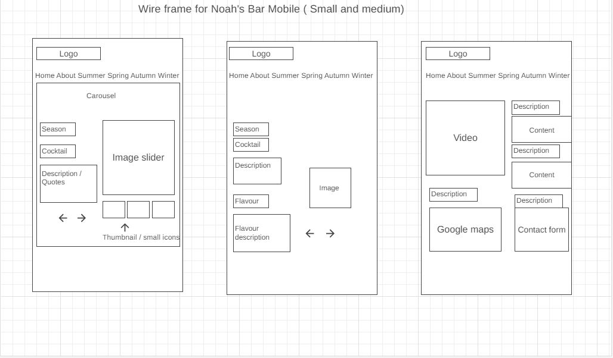
 #### Wireframe for large width devices
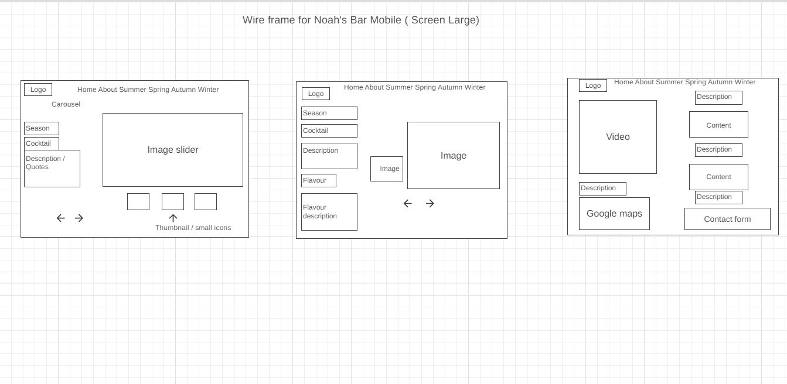

## Final Screenshots
  ### Home Page
  - Small and Medium Screens
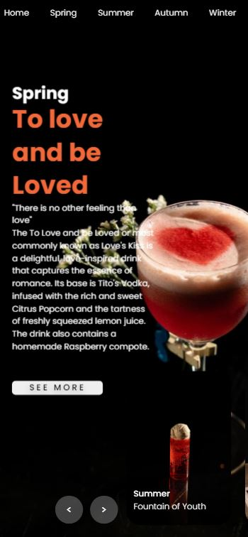
  - Large screens
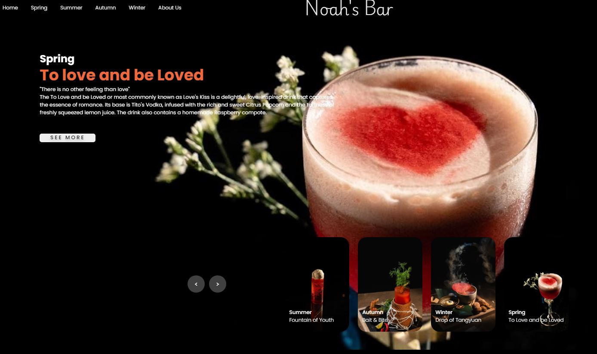

### About Page
  - Small and Medium Screens
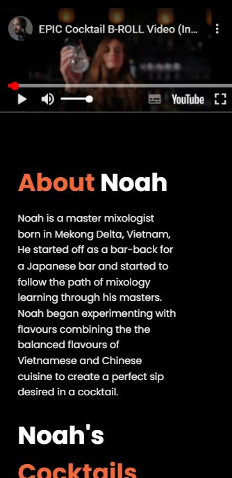
  - Large screens
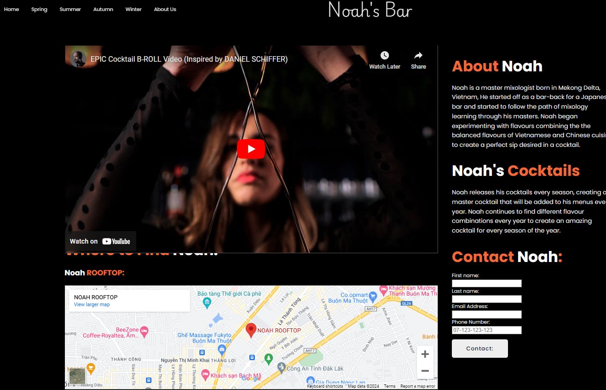

### Cocktail Page
  - Small and Medium Screens
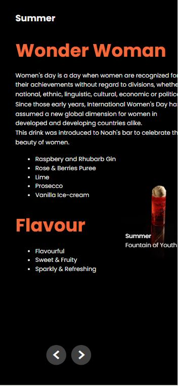
  - Large screens
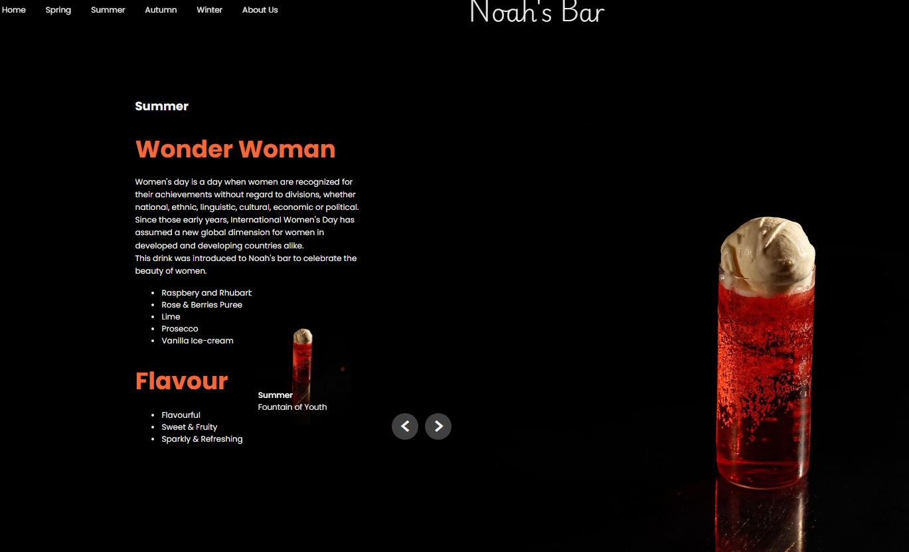

 ### Color palettes:
 The color palette used for the webpage:
 - #f1683a
 - #eee
 - #black
 The #f1683a orange color will be mainly used for headers and buzz words.
 
 
# Development Process

 ### Main Page:
 Carousel system will be used, each slide will represent a specific cocktail from a seasonal collection using JS (carousel.js , carousel.css)

 ### Logo:
 - Logo will be fixed in the top-middle of the page.
  (.logo .logo-p1)
   
### Navigation:
 - For both mobile and widescreen there will be NAV for Home and About Us section (.nav , header)
 - Home will take you to main page
 - About us will take you to the end page, the about us page.
 - See more buttons available on each slide of Carousel which will take user to specific cocktail page.

### Styling:
 
 The white #eee will be for text
 Background will be primarily black, excluding image backgrounds.
 Font will be consistantly Poppins, except for logo.
 General text size between 1.0 - 1.3em
 Header text size betwen 2.8 - 3em

## (1) Home page - Carousel System 
  A carousel system will be used featuring a different cocktail on each slide, on each slide the background will change into a picture of the cocktail as well as a short description. (.carousel)
  
### Layout:
 ### Background:
 - Background will change during each slide, the image will be of the specific cocktail assigned to that slide.
 - a orange line/ timer will be on top of the page as a timer to indicate when the next slide will change (.time)

### Content (.content):
  - Seasonal collection will be first displayed (spring, summer, winter, autumn) (.title)
  - Name of cocktail will be displayed (.topic)
  - A description of the cocktail will be displayed on each slide under the name (.des)

### Arrows:
- There will be arrows for navigation between each carousel slide (.arrows)

### Thumbnail:
- There will be small thumbnails of the drinks at the bottom of the carousel (.thumbnail)

### (2) Cocktail Pages
A standard cocktail page will be used containing two different containers (.image-container , .text-container)

### Layout:

### Background:
- Black background will be used

### Images:
- image of each cocktail will be shown on thte right hand side of page (.image-container)

### Description:
- Description will be on the left side, this will include the season, cocktail name, and flavor profiles. (.text-container)

### Thumbnails:
- There will be thumbnails on each page, this acts as a smaller image of the cocktail image, for a friendlier mobile experience.

## (3) About Page
About page will be the last page, this contains information about the bar, owner as well as other features like a contact form, a video to showcase the bar as well as a Google Maps location.

## Layout:

### Video:
- First will be a video show casing the bartenders abilities, this will come with a controller as well as an external link to the video (.video-container)

### Content:
- On the right of the video will be the content, this is where the user can find more information about the restaurant / owner

### Contact form:
- A contact form has been created in order for the customers to contact for enquiries (.contact)

### Location:
- A google maps location will be placed in the about section to help customers locate the the bar. (.google-map-container)

## (4) Keyframes / Animations used
- showContent - This is the effect used for carousel for the content / description to appear.
- showImage - This is the fade in effect for the images in the carousel
- showThumbnail - This is the thumbnail change for everytime there is a new slide.
- effectNext - This is the effect for when a user clicks next on the carousel
- contentOut - This is the effect for previous in the Carousel
- runningTime - This is orange line/bar that runs on top of page to indicate when the next slide will appear.
- fadeIn - This is the fade in animation for cocktail pages
- outFrame - The fade out effect when previous button is clicked.

## (5) JavaScript Used

### DOM Selection:
- nextDom - Next button
- prevDom - Previous button
- carouselDom - Carousel
- SliderDom - Slider
- thumbnailBorderDom - thumbnail container
- thumbnailItemsDom - thumbnail img
- timeDom - Timer on top of page.

### Functions:
- Functions have been created (.onclick) for next and previous slide
- A timer has been created for the carousel
- A timer has been created for orange timer above Nav.
- Function with affect to prepend and append carousel slide

## Error testing and deployment

### HTML Error testing
  #### HTML errors
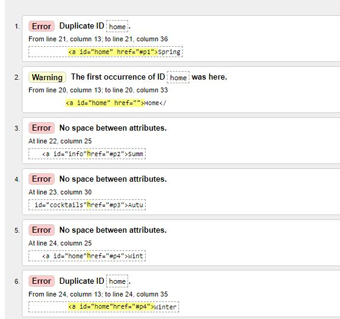
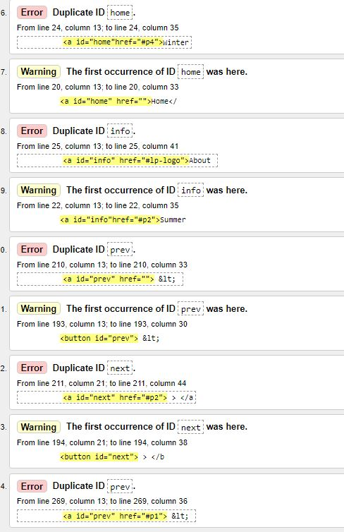
  #### CSS errors
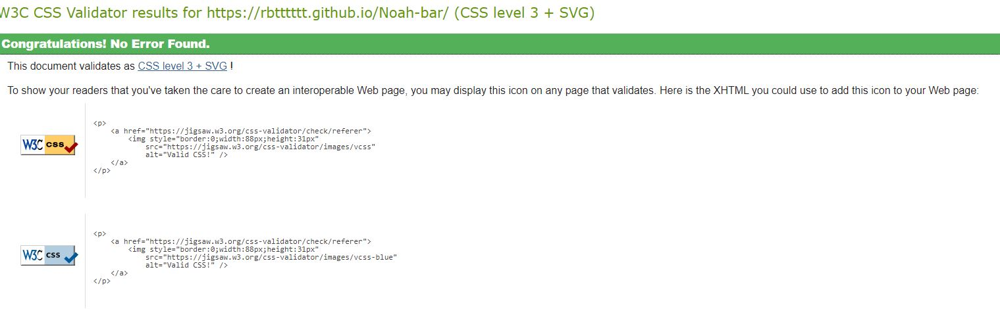

- All bug fixes has been documented in commits on GitHub.

## Sources & Resources used:
### Images for cocktails: https://www.facebook.com/Mr.MonkeyX (permission given)
### Video: https://www.youtube.com/embed/P2EOVODrSzs
### Carousel tutorial: https://www.youtube.com/watch?v=A5CK6Uqe_YU&list=PLwJhhWUZudKq1F7SAvi1uWhzHLeNy21NG

  
